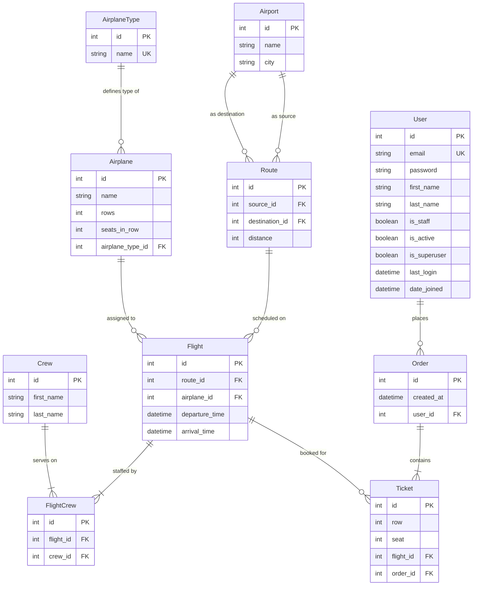

# Airport API Service

**Airport API Service** is a robust, production-ready backend RESTful API built with Python, Django, and Django REST Framework (DRF). It is designed to manage airport operations, flight routes, airplane inventory, flight crew assignments, and passenger ticket bookings. The application includes secure JWT-based authentication, optimized database queries, administrative panels, and automated OpenAPI documentation.

### Key Features
- **User Authentication & Authorization**: Secure user registration and token-based authentication using JSON Web Tokens (JWT) via SimpleJWT.
- **Flight & Route Management**: Define flight routes between source and destination airports, schedule flights, and manage flight states.
- **Fleet & Crew Allocation**: Manage airplane inventories, group airplanes by airplane types, specify seating configurations (rows and seats), and assign crew members to scheduled flights.
- **Ticketing & Order System**: Complete ticket booking flow allowing users to purchase multiple tickets per order. Utilizes transaction-level row locking (`select_for_update`) to prevent concurrent double-booking of seats.
- **Advanced Search & Filtering**: Easy search and filtering of flights (by route, departure/arrival date), airports (by name/city), and airplanes.
- **Performance Optimized**: Uses query annotation, `select_related`, and `prefetch_related` optimizations to solve N+1 query bottlenecks.
- **Auto-generated Documentation**: Fully interactive API documentation using Swagger UI and ReDoc, generated automatically via `drf-spectacular`.

### Tech Stack
- **Framework**: Django 5.2
- **REST API**: Django REST Framework 3.16
- **Authentication**: SimpleJWT
- **Database**: PostgreSQL (Production/Docker), SQLite (Local development default)
- **WSGI Server**: Gunicorn (for containerized deployments)
- **API Documentation**: OpenAPI 3.0 via `drf-spectacular`
- **Containerization**: Docker & Docker Compose

---

## Database Structure & Entity Relationship Diagram (ERD)

The database schema consists of several core models representing airports, airplane configurations, flight scheduling, crew assignments, and user ticketing.



### Table & Model Explanations

- **User**: Custom user model using `email` as the primary identifier instead of a username.
- **Airport**: Represents physical locations (airports) with `name` and `city`.
- **AirplaneType**: Classifications of airplanes (e.g. Boeing 737, Airbus A380).
- **Airplane**: Specific airplanes containing details on the number of `rows` and `seats_in_row`. Linked to `AirplaneType`.
- **Crew**: Flight crew members with first and last names.
- **Route**: A connection between a `source` airport and a `destination` airport, including the `distance` in kilometers.
- **Flight**: A scheduled instance of an `Airplane` flying a specific `Route` with a departure time, arrival time, and assigned `Crew` members (Many-to-Many).
- **Order**: A collection of booked tickets placed by a `User`.
- **Ticket**: Represents a specific seat reservation (`row` and `seat`) on a `Flight` within a user `Order`.

---

## Setup & Launch Instructions

Detailed project launch instructions can be found in the [CODE_REVIEW_AND_SETUP_GUIDE.md](file:///C:/Users/VikTOR/PycharmProjects/airport_api_service/CODE_REVIEW_AND_SETUP_GUIDE.md) file. Below is a quick start guide.

### 1. Create a Virtual Environment & Activate

```bash
# Windows
python -m venv .venv
.\.venv\Scripts\Activate.ps1

# macOS/Linux
python3 -m venv .venv
source .venv/bin/activate
```

### 2. Install Dependencies

```bash
pip install -r requirements.txt
```

### 3. Setup Environment Variables

Create a `.env` file in the root directory:

```env
DJANGO_SECRET_KEY=your-secret-key
DEBUG=True
ALLOWED_HOSTS=localhost,127.0.0.1
DJANGO_SETTINGS_MODULE=airport_service.settings.dev
```

### 4. Run Migrations & Start Server

```bash
python manage.py migrate
python manage.py runserver
```

---

## Running with Docker

Docker support is fully integrated for running both the web application and PostgreSQL database services seamlessly.

### Prerequisites
Make sure you have [Docker](https://www.docker.com/) and [Docker Compose](https://docs.docker.com/compose/) installed on your machine.

### 1. Build & Run Services
To build the images and run the containers in detached (background) mode, run:
```bash
docker-compose up --build -d
```

This command will:
1. Spin up a PostgreSQL database container.
2. Build the web app container, install the python dependencies, and collect static files.
3. Start the application server with Gunicorn, exposed on port `8000`.

### 2. Apply Database Migrations
Once the containers are running, execute database migrations to set up the DB schema:
```bash
docker-compose exec web python manage.py migrate
```

### 3. Create a Superuser
To create an administrative user account:
```bash
docker-compose exec web python manage.py createsuperuser
```
Follow the prompts to enter email and password.

### 4. Load Sample Data (Optional)
If you have data fixtures to load (e.g., from a fixtures directory):
```bash
docker-compose exec web python manage.py loaddata <fixture_name>.json
```

### 5. Stopping the Containers
To stop and remove containers and networks created by `up`:
```bash
docker-compose down
```
If you also want to remove persistent volumes (which deletes database data), run:
```bash
docker-compose down -v
```
